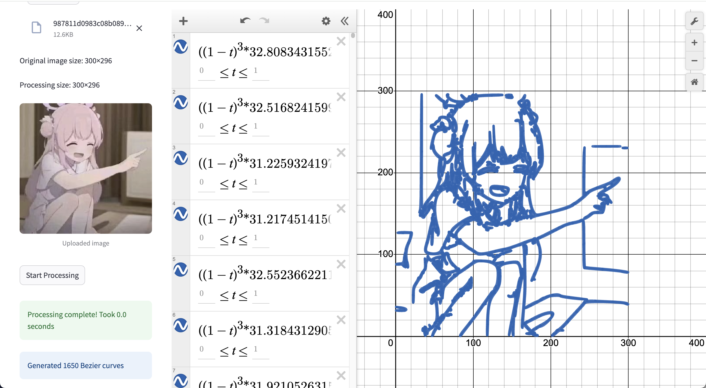

# Desmos Art Generator



A Streamlit application that converts images and videos into vector art using Bézier curves, then renders them interactively in Desmos graphing calculator.

## Description

This application:
- Processes images and videos to extract edges
- Converts the edges into Bézier curve expressions
- Renders the expressions in Desmos graphing calculator
- Supports both still images and animated videos
- Offers customization options like color selection, filtering, and optimization

## Dependencies

The application requires the following Python packages:
- opencv-python~=4.11.0.86
- numpy~=2.2.3
- streamlit~=1.43.0
- pypotrace (must be installed manually)

## Installation

1. Clone this repository
2. Install required Python packages:
   ```bash
   pip install -r requirements.txt
   ```

3. **Important**: Install pypotrace manually from https://github.com/flupke/pypotrace

## Usage

1. Run the Streamlit app:
   ```bash
   streamlit run app.py
   ```

2. Use the sidebar options to:
   - Select media type (image or video)
   - Choose line color
   - Toggle filters and display options
   - Adjust video processing parameters (when applicable)

3. Upload an image or video file and click "Start processing"

4. The processed Bézier curves will be displayed in an interactive Desmos calculator

## Performance Notes

- Processing large images or videos may take significant time
- For videos, consider reducing the scale factor and maximum expressions per frame
- The application limits the number of expressions to prevent browser performance issues